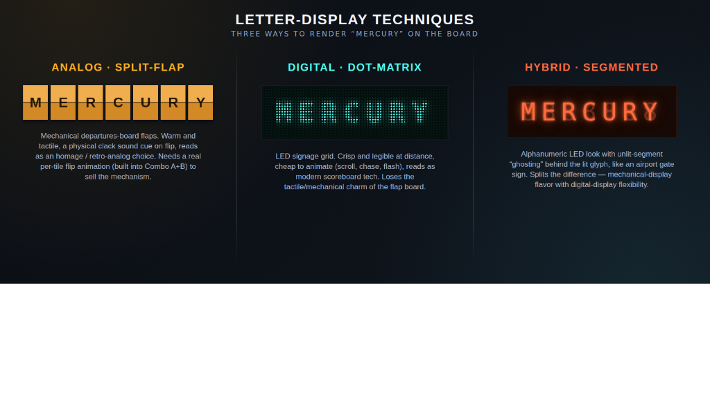

# TToTO — Visual Implementation Notes

> **Status: visual direction confirmed; not yet implemented.**
> Companion to [`../ttoto-concept.md`](../ttoto-concept.md), which defines *what the game
> is*. This file defines *how the confirmed visual direction is built*, so it can be handed
> to a separate codebase without re-deriving any of it from screenshots.

Everything here reflects decisions actually made and confirmed during the visual-design
pass. Where something is still open, it's called out explicitly in §7 rather than implied by
omission.

**Companion files:**
- [`reference-combo-screen.html`](reference-combo-screen.html) — committed. A standalone (no
  design-tool wrapper), verified-rendering HTML/CSS/JS implementation of the confirmed
  screen. Copy/adapt this directly; don't rebuild from the screenshots.
- [`ttoto-letterstyles-preview.png`](ttoto-letterstyles-preview.png) — committed. The three
  letter-display techniques rendering the same word side by side (§4).
- `crackvariants-preview.png` — the four miss-state crack patterns (§5). **Not committed —
  see §9.**
- `crackrotation-preview.png` — rotation test for the crack overlay (§5). **Not committed —
  see §9.**

---

## 1. Chosen Direction

**"Combo A+B"**: Tri-Split Signal's saturated HUD panels (angular chevron-cut corners,
deep-color gradient fields, drop-shadow glow) carrying Split-Flap Showdown's animated
letter-tile mechanic for revealing answers. Two other directions (Tri-Split alone, "Steal
the Spotlight" beam-of-light concept) were explored and set aside — not deleted from the
design canvas, but not the build target.

**Fonts** (Google Fonts, loaded via the standard `@import`/`<link>` — no self-hosting
needed):

- `Big Shoulders Display` (700/800/900) — all display type: logo, round-type name, score
  numerals, panel tags.
- `Barlow Condensed` (500/600/700) — body/label text, tile letters, captions.

**Palette** (confirmed, in use in `reference-combo-screen.html`):

| Role | Color |
|---|---|
| THIS (Team 1 / crimson) | border/tag `#e0625f`, ambient glow `rgba(224,98,95,…)` |
| THAT (amber / active) | border/tag `#ffb020` |
| THE OTHER (Team 2 / cyan) | border/tag `#3ec2d9`, ambient glow `rgba(62,194,217,…)` |
| Base background | `linear-gradient(135deg, #0a3145, #12233f, #1c1030, #12070f)` |
| Prompt/question panel | steel-blue, border `#4a6a95`, tag background `#c7d4ea` |

Panel corners use `clip-path: polygon(...)` chevron cuts (see `.ttoto-a-panel` /
`.ttoto-a-tag` in the reference file) rather than plain rounded rectangles — this is a
deliberate, repeated motif, not incidental styling.

---

## 2. Layout Decisions

- **Score plates** flank a centered logo lockup; score numerals are large (92px) and are the
  most visually dominant header element after the round-type name.
- **Round TYPE is dominant, round NUMBER is a small pill above it** — e.g. a small
  "ROUND 2" tag sits above a large "STRAIGHT TRIVIA" headline, not the reverse. Deliberate:
  players should read *what kind of round this is* faster than *which number it is*.
- **The prompt/question bar carries a "QUESTION" tag**, styled identically to the
  THIS/THAT/THE OTHER tags on the answer panels below it. Added specifically because an
  earlier draft had no visual marker on the prompt and it read as weaker/less important than
  the answer panels — the tag brings it to visual parity.
- **Three answer panels (THIS / THAT / THE OTHER)** sit in a row below the prompt, each
  independently stateful — see §3.
- All measurements in the reference file assume a 1600×900 canvas (matches the existing
  NTT/Survey Says screen conventions); scale proportionally if the real build target differs.

---

## 3. Panel States

Each of the three answer panels can independently be in one of (at least) these visual
states — shown side-by-side in `reference-combo-screen.html`:

| State | Visual signal |
|---|---|
| Standby / available | Cyan/neutral border, small solid dot, "AVAILABLE" label |
| Active / on the clock | Amber border + stronger glow, pulsing dot (glow via `box-shadow`), "SIGNAL LOCKED" label |
| Missed / wrong | Crimson border, crack graphic overlaid (§5), "X TEAM N — MISSED" label |
| Correct | **Not yet mocked** as a distinct static frame — needs a "win" state designed, likely a green/gold flash and no crack, analogous to the miss state. |

The tile row itself (§4) is what actually reveals the letters. Panel border/tag colors are
per-team (THIS = Team 1 color, THE OTHER = Team 2 color) and stay fixed regardless of state,
while the state labels/dot/crack layer on top.

---

## 4. Letter-Display Architecture

Three techniques were prototyped side-by-side in `LetterStyles.dc.html` on the design
canvas. **Decision: style is tied to round type, not all three used at once on screen.**
Specific round-type → technique pairings are still open (§7) — what's locked in is the
*mechanism* for each technique, all three achievable with zero per-character or per-word
image assets.

Side-by-side comparison (all three rendering "MERCURY"):

Character of each, to inform the pairing decision:

| Technique | Reads as | Trade-off |
|---|---|---|
| Analog split-flap | Mechanical departures board — warm, tactile, retro-analog homage, with a physical clack cue on flip | Needs the real per-tile flip animation (§4d) to sell the mechanism |
| Digital dot-matrix | LED signage / modern scoreboard — crisp and legible at distance, cheap to animate (scroll, chase, flash) | Loses the tactile/mechanical charm of the flap board |
| Hybrid segmented | Airport gate sign — alphanumeric LED with unlit-segment ghosting behind the lit glyph | Splits the difference: mechanical flavor, digital flexibility |

### 4a. Analog split-flap (the technique built out fully — see §4d)

Font-driven. Each tile is a two-sided rotating card built from two `
` faces
(front/back), animated with a CSS `transform: rotateX()` transition — no images, no
per-letter sprites, no pre-rendered flip frames.

### 4b. Digital dot-matrix

CSS-only pixelation via `mask-image` (with `-webkit-mask-image` fallback): a repeating
radial-gradient dot grid (6px cells) masks solid text (`'Share Tech Mono'` or similar
monospace, bold, ~60px). This punches the glyph fill into a genuine grid of dots rather than
just adding a faint texture behind smooth text — the earlier attempt did the latter and read
as "basically normal text," which is why it was rebuilt. No font changes needed beyond
loading the monospace family.

### 4c. Hybrid segmented (7-segment-style)

Layered "ghost" trick, same one digital clocks/scoreboards use: a dim, full "all segments
lit" version of the word sits directly behind the actual bright lit text, at a slightly
darker shade of the same hue. Concretely: render a same-length string of repeated `8`
characters (`"8888888"` for a 7-letter word) in a muted color as a background layer, then
the real word on top in the bright/lit color. This creates the visible unlit-segment
watermark effect.

**Flagged upgrade path, not yet implemented:** a real 14-segment or DSEG-style font file
would render more authentic segment shapes than a standard typeface can fake — worth
sourcing if this style becomes a first-class round type rather than a variant flourish.

### 4d. The flip mechanic, in full (the one with actual working code)

Rebuilt once after a bug where the first version looked like tiles "fading in" / images
loading rather than physically flipping. Root cause and fix, for anyone touching this code:

- **Broken approach (do not reintroduce):** single-face element, CSS `@keyframes` resetting
  rotation to a fixed steep starting angle at the start of every step, combined with an
  opacity fade. Because `backface-visibility: hidden` makes an element invisible through most
  of its rotation past ~90°, this produced a pop/flicker, not a flip.
- **Correct approach** (implemented in `reference-combo-screen.html`, module
  `window.TToTOFlipBoard`): each tile (`.flap-cell`) contains a `.flap-card` with
  `transform-style: preserve-3d`, holding two absolutely-positioned `.face` children —
  `.face.front` at `rotateX(0deg)`, `.face.back` pre-rotated to `rotateX(180deg)`, both
  `backface-visibility: hidden`. One flip = animate `.flap-card`'s `transform` from
  `rotateX(0deg)` to `rotateX(-180deg)` via a CSS `transition` (150ms,
  `cubic-bezier(.36,.1,.2,1)`), then on `transitionend`, snap back to `rotateX(0deg)` with
  `transition: none` and copy the new letter onto the front face at that exact instant. The
  snap is invisible because it happens at the same moment the visible face swaps — this is
  what makes it read as one continuous rotating card rather than two separate elements.
- **Cascade behavior (the "real Solari board" effect):** each tile independently runs a
  random number of flip-steps (5–11) through random filler letters before landing on its
  actual target letter on the final step, with a randomized per-tile start delay (0–260ms)
  so tiles begin and land out of sync and out of left-to-right order. Implemented as
  `runTile()` in the module.
- **Public API** (`window.TToTOFlipBoard` in the reference file):
  - `buildRow(rowEl, wordLength, variant, tileSize)` — (re)builds a row's tile markup for a
    given word length and color variant (`'this' | 'that' | 'other'`). Call whenever the
    answer length changes, i.e. every new question.
  - `cascadeRow(rowEl, word, opts)` — triggers the flip cascade to land on `word`. Call once
    per round load, when the host reveals/advances the prompt. `opts` can override
    `stepMs` / `minSteps` / `maxSteps` / `maxStartDelay` if pacing needs tuning per round
    type.
  - `resetRow(rowEl)` — blanks a row back to dashes instantly, no animation. Useful between
    questions.
- The demo loop at the bottom of `reference-combo-screen.html` is explicitly marked
  "DEMO ONLY" and should be deleted in the real integration — call `buildRow` +
  `cascadeRow` from the actual round-load logic instead.

---

## 5. Miss-State "Crack" Graphic

The crack that overlays a panel in the missed state went through several rounds of feedback:
from a single straight line, to a jagged single path, to something that reads as an actual
crack across the *whole* panel rather than a thin band near the answer text. It's built as
inline SVG — a jagged multi-point polyline rendered twice (a wide blurred glow stroke behind
a crisp bright core stroke), plus 1–3 short branch paths off the main line for the branchier
variants.

**Four variants were mocked up for comparison** (`CrackVariants.dc.html` on the design
canvas, screenshot in `crackvariants-preview.png`), rather than shipping one fixed shape:

| Variant | Shape | Suggested use |
|---|---|---|
| A — Hairline | Single clean zigzag, no branches | Easy/near-miss — a light "ding," not a shatter |
| B — Fork | One main zigzag + 2 branches (**current default**, used in the ComboAB reference screen) | Standard miss |
| C — Spider-web | 8 rays radiating from one central impact point | Hard/decisive miss — "the big one" |
| D — Corner shatter | Diagonal crack driven in from one panel corner, + 3 branches | Alternate severe variant, to alternate with Spider-web |

Each variant's trajectory was deliberately varied (A runs a near-vertical zigzag with no net
horizontal drift, B runs top-left to bottom-right, C radiates in all directions from a center
point, D comes down from the *top-right* corner rather than mirroring B's diagonal) — the
first pass had A/B/D all trending the same top-left-to-bottom-right direction, which read as
one shape reused rather than a real library. If more variants are added later, keep varying
entry point/direction the same way rather than reusing a trajectory.

**Recommendation, not a final decision:** select a variant based on miss severity/difficulty
tier if the game tracks that, otherwise pick at random each time a panel goes to miss state
so repeat viewings don't always show the identical crack. The `<svg>`'s `d` path attributes
are the only thing that needs to swap between variants — same stroke styling, same
container.

**Also apply a random rotation on top of the random variant** — tested in
`CrackRotation.dc.html` (screenshot `crackrotation-preview.png`) at 0°/30° on Fork and
0°/−120° on Corner Shatter. This multiplies the effective variety from 4 fixed shapes to
something close to unlimited, with zero new paths to draw: wrap the `<svg>` in the existing
positioned container (already named `.crack-wrap` in the test file) and apply
`transform: rotate(<random>deg); transform-origin: 50% 50%;` to that wrapper, picking the
angle per miss event (e.g. `Math.random() * 360 - 180` for full range, or narrow to ±45° if
a subtler jitter is preferred over a fully tumbled crack). Both the mild (30°) and extreme
(−120°) test angles still read clearly as a crack — the panel's existing `clip-path` already
contains whatever rotates outside the visible chevron shape, so an aggressive angle just
clips at the edge rather than breaking anything, which itself reads fine (as if the crack ran
off toward the frame). No other CSS changes needed.

**Sizing (confirmed):** the SVG container spans nearly the full panel (`width: 88%`,
`left: 6%` of the panel, height ~420px on a 900px-tall panel) — do not shrink this back down
to a band around just the answer tiles; that was explicitly called out as insufficient in
review.

---

## 6. Asset Strategy

None of the three letter-display techniques require per-character, per-word, or per-frame
image assets — all are font + CSS/JS driven, because they need to render arbitrary words the
game doesn't know in advance.

Given the stated preference for an asset-based visual approach (as used on Survey Says)
rather than pure HTML/CSS/JS (as NTT was built), the recommended split is:

- **Font/CSS-driven (must stay this way):** the actual dynamic answer text in all three
  letter-display styles, since the content is arbitrary at runtime.
- **Designed art assets (where the "looks nicer" polish should go):** panel frame/bezel
  chrome, corner brackets, the logo lockup, hinge/mechanical texture details on the flap
  tiles if a more physical look is wanted than gradients alone provide, and the crack
  graphics (could ship as illustrated crack-texture PNGs/SVGs instead of programmatically
  drawn paths, if a hand-designed look is preferred over the current procedural one).

Recommendation, not a locked decision — flagged in §7.

---

## 7. Explicitly Open / Not Yet Decided

Still open from [`../ttoto-concept.md`](../ttoto-concept.md) §10:

- Open-steal eligibility when `Steal Mode = TIMED_WINDOW`.
- Reveal timing (prompt-then-choices vs. all at once) and the false-start penalty that
  depends on it.
- Double-miss consolation rule.
- Point-value curve across a round-type rotation, and the shape of a final/bonus round.
- Whether any round-type flavor needs more than 3 answer choices.

*(Note: the visual pass listed "individual-wand (non-team) mode adaptation" as open, but the
concept doc §5 has since resolved it — two teams, every player on a wand, buzz-in race.)*

New from this visual pass, still open:

- **Scoring/point values** — explicitly deferred by design, pending the round-sequence
  shape. Discussed but not decided: flat (a fixed value per round, higher rounds simply come
  later) vs. escalating per round position vs. varying by flavor "weight." Current lean, not
  confirmed: "later rounds are worth more" as the simpler rule, keeping the same 100s-scale
  point values used in NTT for player familiarity.
- **Round-sequence/session shape** — a fixed overall escalating structure with flavor
  rotation varying per session was discussed as the likely pattern (with Media ID / Closest
  Guess treated as bigger/finale-appropriate, Straight Trivia / Category Sort / Odd One Out
  as baseline, Real or Fake as a mid-session twist). A sample 5-round sequence was floated
  (Straight Trivia → Category Sort → Real or Fake → Odd One Out → Media ID) but **not
  confirmed**.
- **Round-type → letter-display-technique pairing** — confirmed that style is tied to round
  type (not all three on screen at once), but which flavors get split-flap vs. dot-matrix vs.
  segmented is unassigned.
- **Crack variant selection rule** — random vs. difficulty-tiered, and which variant is
  "default" if the game doesn't track severity (§5).
- **Win-state panel visual** — no confirmed win/correct-answer state designed yet, only
  standby/active/missed (§3).
- **Segmented-display font upgrade** — source a real 14-segment/DSEG-style font, or keep the
  ghost-layer fake (§4c)?
- **Asset-vs-code split for chrome/crack graphics** — recommended in §6, not locked.

---

## 8. What to Actually Copy

For a first integration pass: take `reference-combo-screen.html` as-is, wire
`TToTOFlipBoard.buildRow()` / `.cascadeRow()` / `.resetRow()` to real round-load and
answer-reveal events (replacing the demo IIFE at the bottom), wire the score / round-number /
round-type / prompt-text elements (already tagged with ids `score-team1`, `score-team2`,
`round-number`, `round-type`, `prompt-text`) to real game state, and swap the crack `<svg>`'s
path data for whichever of the four variants in §5 is selected per miss event.

---

## 9. Missing Companion Files

`reference-combo-screen.html` is committed next to this file — that's the piece that matters,
since it holds the only working implementation of the flip mechanic (§4d) and is the starting
point for §8.

Still on the design canvas and **not in this repo**, worth exporting when convenient (all
reference-only — nothing here blocks implementation):

- `crackvariants-preview.png`, `crackrotation-preview.png` (§5).
- The working canvas files referenced in passing: `LetterStyles.dc.html`,
  `CrackVariants.dc.html`, `CrackRotation.dc.html`. The dot-matrix (§4b) and segmented (§4c)
  techniques have a committed screenshot but no committed code — unlike the split-flap style,
  they are not implemented in the reference screen, so whoever builds them works from the
  prose in §4b/§4c plus the preview image unless `LetterStyles.dc.html` is exported.
